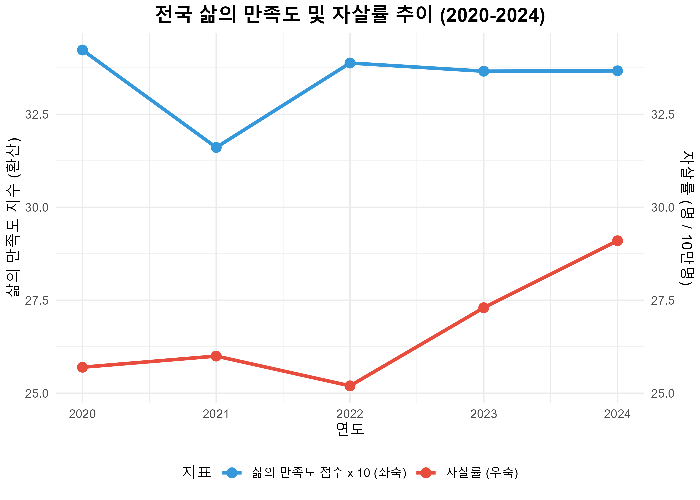
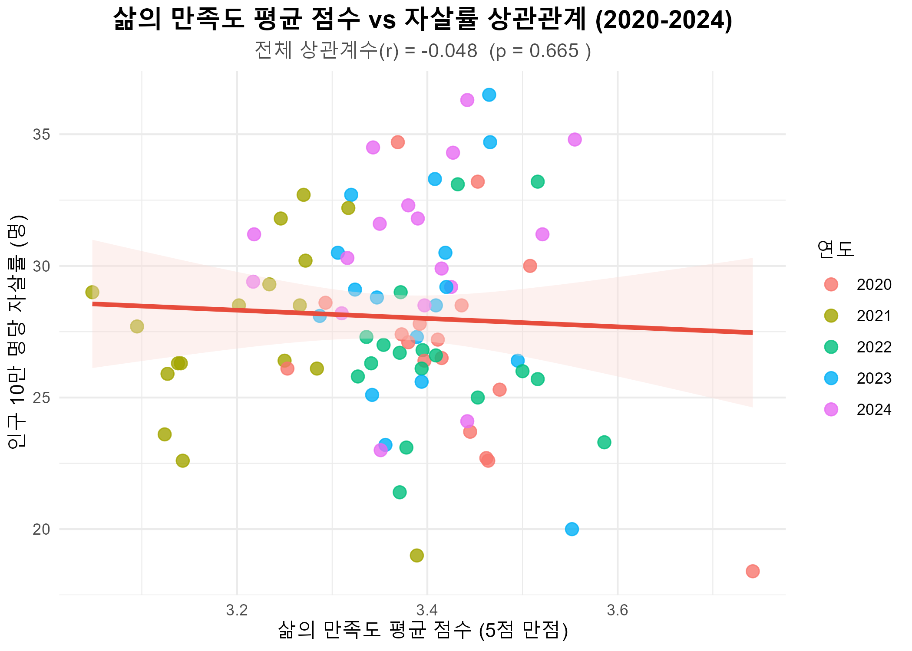
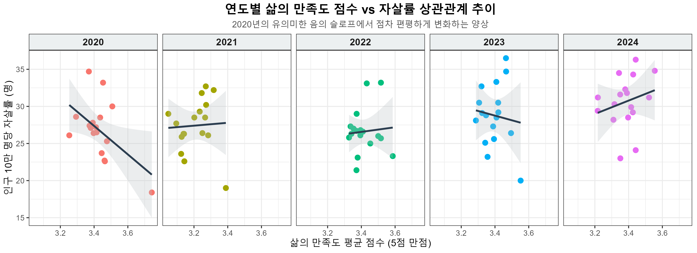
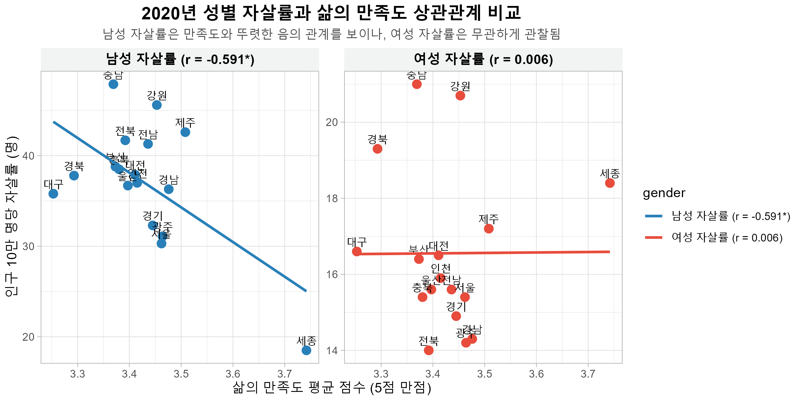
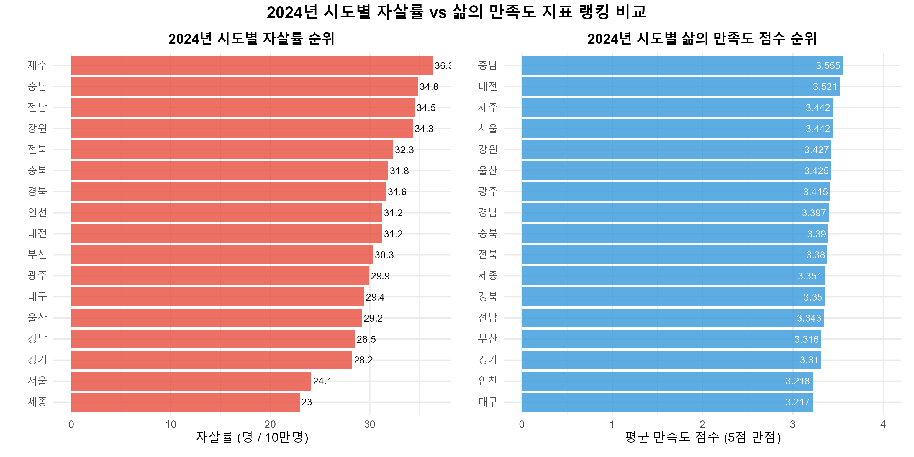
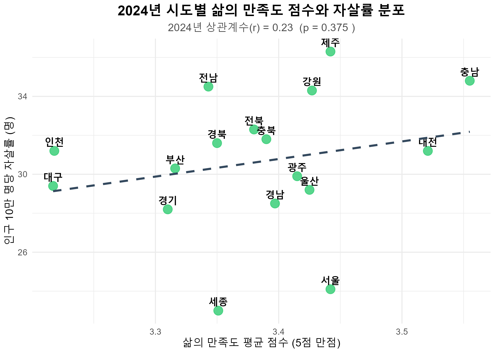

# 삶의 만족도와 자살률 간의 상관관계 분석 보고서 (2020-2024)

본 보고서는 국가데이터처의 「사회조사」(삶의 만족도) 및 「사망원인통계」(인구 십만명당 자살률) 데이터를 결합하여, 2020년부터 2024년까지의 전국 17개 시도별 삶의 만족도와 자살률 간의 상관관계를 통계적·시각적으로 정밀 분석한 보고서입니다.

---

## 1. 분석 개요 및 데이터 전처리

### 1.1 분석 데이터 개요
* **데이터 1 (삶의 만족도)**: 2020~2024년 시도별 삶의 만족도 비율 (%)
  * 매우 만족, 약간 만족, 보통, 약간 불만족, 매우 불만족의 5개 척도 구성
* **데이터 2 (자살률)**: 2020~2024년 시도별 인구 10만 명당 자살률 (명)
  * 전체(계), 남성, 여성 데이터 구성

### 1.2 데이터 전처리 및 정량화
1. **지역명 표준화**: 두 데이터의 지역 표기법(예: '전북특별자치도' ↔ '전라북도', '제주특별자치도' ↔ '제주도')을 17개 시도 행정구역 명칭으로 통일하여 결합했습니다.
2. **평균 만족도 점수 산출**: 삶의 만족도 5단계 비율을 점수화하기 위해 다음과 같이 가중 평균을 적용한 **'평균 만족도 점수 (5점 만점)'**를 산출했습니다.
   $$\text{평균 만족도 점수} = \frac{(\text{매우만족} \times 5) + (\text{약간만족} \times 4) + (\text{보통} \times 3) + (\text{약간불만족} \times 2) + (\text{매우불만족} \times 1)}{100}$$
3. **만족율 및 불만족율**: 긍정 답변(매우 만족 + 약간 만족)의 합을 **만족율(%)**, 부정 답변(약간 불만족 + 매우 불만족)의 합을 **불만족율(%)**로 정의했습니다.

---

## 2. 전국 단위 시계열 추이 분석 (국가 수준)

전국(National) 데이터를 기준으로 연도별 흐름을 분석한 결과, **국가 전체 차원에서는 삶의 만족도와 자살률 간의 역(Inverse)관계**를 확인할 수 있습니다.

| 연도 | 만족율 (%) | 평균 만족도 점수 (5점 만점) | 전국 자살률 (10만 명당, 명) | 남성 자살률 (명) | 여성 자살률 (명) |
| :--- | :---: | :---: | :---: | :---: | :---: |
| **2020** | 42.7 | 3.423 | 25.7 | 35.5 | 15.9 |
| **2021** | 34.0 | 3.161 | 26.0 | 35.9 | 16.2 |
| **2022** | 43.3 | 3.388 | 25.2 | 35.3 | 15.1 |
| **2023** | 42.2 | 3.366 | 27.3 | 38.3 | 16.5 |
| **2024** | 40.1 | 3.367 | 29.1 | 41.8 | 16.6 |

> [!NOTE]
> * **2020년 → 2021년**: 코로나19 여파로 전국 평균 만족도 점수가 **3.423점에서 3.161점으로 급감**했을 때, 자살률은 **25.7명에서 26.0명으로 상승**했습니다.
> * **2021년 → 2022년**: 일상 회복과 함께 삶의 만족도가 **3.388점으로 반등**하자, 자살률은 **25.2명으로 감소**했습니다.
> * **2022년 → 2024년**: 삶의 만족도가 정체 내지 소폭 감소(3.388점 → 3.367점)하는 상황에서 자살률은 **25.2명에서 29.1명으로 대폭 상승**하는 양상을 보였습니다. 2024년의 자살률 상승은 남성 자살률(41.8명)의 급격한 증가가 견인했습니다.

---

## 3. 시도별 상관관계 분석 (Regional Correlation)

전국 17개 시도 데이터를 매칭하여 삶의 만족도 지표와 자살률 간의 피어슨(Pearson) 상관계수를 분석했습니다. (전국 평균 행 제외, $N = 85$ 개 관측치)

### 3.1 전체 기간 통합 상관계수
* **평균 만족도 점수 vs 전체 자살률**: $r = -0.048$ ($p = 0.665$) $\rightarrow$ 상관관계 없음.
* **만족율 (%) vs 전체 자살률**: $r = -0.170$ ($p = 0.119$) $\rightarrow$ 약한 음의 관계를 보이나 통계적으로 유의하지 않음.
* **불만족율 (%) vs 전체 자살률**: $r = -0.177$ ($p = 0.106$) $\rightarrow$ 약한 음의 관계를 보이나 통계적으로 유의하지 않음.

### 3.2 연도별 상관관계 슬로프의 변화
전체 통합 데이터에서는 상관관계가 유의하지 않지만, 연도별 17개 시도를 쪼개어 분석하면 시간의 흐름에 따른 뚜렷한 슬로프 변화가 포착됩니다.

| 연도 | 분석 지역 수 ($N$) | 만족도 점수-자살률 상관계수 ($r$) | 유의확률 ($p$-value) | 남성 자살률 상관계수 ($r$) | 여성 자살률 상관계수 ($r$) |
| :--- | :---: | :---: | :---: | :---: | :---: |
| **2020** | 17 | **-0.514** | **0.035** * | **-0.591** * | 0.006 |
| **2021** | 17 | 0.049 | 0.849 | 0.087 | -0.093 |
| **2022** | 17 | 0.077 | 0.769 | 0.184 | -0.217 |
| **2023** | 17 | -0.109 | 0.678 | -0.245 | 0.362 |
| **2024** | 17 | 0.230 | 0.375 | 0.198 | 0.081 |

> [!IMPORTANT]
> **2020년의 유의미한 음의 상관관계 ($r = -0.514, p < 0.05$)**
> 2020년에는 삶의 만족도가 높은 지역일수록 자살률이 뚜렷하게 낮았습니다. 아래 연도별 회귀선 추이에서 보듯, **2020년에는 뚜렷한 우하향 회귀선**을 그리던 관계가, 2021년 코로나 피크를 기점으로 회귀선이 편평해지고, 2024년에는 미세한 우상향 형태마저 띄며 상관관계가 무너지는 흐름을 한눈에 볼 수 있습니다.

### 3.3 성별에 따른 만족도-자살률 상관관계 격차 (2020년 기준)
2020년에 나타난 강력한 음의 상관관계는 성별 분석 시 더욱 의미 깊은 패턴을 보입니다.
* **남성 자살률-만족도 상관관계**: **$r = -0.591$ ($p = 0.012$ * 유의)** $\rightarrow$ 삶의 만족도가 낮은 지역일수록 남성의 자살률이 매우 높게 나타남.
* **여성 자살률-만족도 상관관계**: **$r = 0.006$ ($p = 0.982$ 무관)** $\rightarrow$ 여성 자살률은 해당 지역의 삶의 만족도 수준과 전혀 상관이 없음.

이 현상은 남성의 극단적 선택이 지역의 삶의 만족도(혹은 사회경제적 스트레스 지수)에 훨씬 더 직접적인 영향을 받는 반면, 여성의 자살률은 지역 전체의 만족 지표 외의 다른 심리·사회적 요인(예: 밀착 관계망 등)이 더 큰 작용을 함을 시사합니다.

---

## 4. 2024년 시도별 지표 랭킹 및 지역적 역설 (Regional Paradox)

2024년 시도별 상세 비교 결과는 만족도와 자살률이 일치하지 않는 '지역적 역설'을 명확히 증명합니다.

### 4.1 시도별 지표 랭킹 비교 (2024년)
자살률이 가장 높은 지역들과 삶의 만족도가 높은 지역들이 상당수 겹치고 있습니다.

* **자살률 상위권**: **제주(36.3명, 1위)**, **충남(34.8명, 2위)**, **전남(34.5명, 3위)**
* **만족도 상위권**: **충남(3.555점, 1위)**, **대전(3.521점, 2위)**, **서울/제주(3.442점, 공동 3위)**

> [!WARNING]
> **역설적 분포의 확인**
> * **충청남도**는 만족도 전국 1위이지만 자살률은 전국 2위입니다.
> * **제주특별자치도**는 만족도 공동 3위이지만 자살률은 전국 1위입니다.
> * **대구광역시**는 만족도 전국 최하위(3.217점)이지만 자살률은 29.4명으로 전국 중간 수준이며, **경기도** 역시 만족도는 하위 3위(3.310점)이지만 자살률은 하위 3위(28.2명)로 낮게 통제되고 있습니다.

### 4.2 지역적 역설이 발생하는 이유 (사회학적 해석)

1. **인구학적 노령화와 고립 (충남/전남 등)**
   농어촌 비중이 높은 시도는 청장년층 인구 유출과 고령층 급증을 겪고 있습니다. 대다수 일반 주민은 주관적인 생활 안정으로 '만족도' 조사에서 높게 평가할 수 있으나, 독거노인의 빈곤·병고·우울증 등 극단적인 취약 지대에 놓인 인구층의 자살 문제가 통계상의 자살률을 높이는 **양극화 현상**이 나타납니다.
2. **물리적 사회 안전망의 격차 (대도시 vs 지방)**
   서울, 경기 등의 수도권 및 대도시는 일상 경쟁과 비교 스트레스로 인해 보고되는 주관적 삶의 만족도는 낮습니다. 하지만 정신건강 인프라, 응급 보건 체계, 복지 시설 등이 지방에 비해 조밀하게 갖춰져 있어 실질적인 자살 시도 예방 및 위기 대응 면에서 비교적 안전한 환경(자살 방어 인프라)을 가집니다.
3. **제주의 지리적·환경적 요인**
   제주는 천혜의 자연환경으로 삶의 주관적 만족도는 높지만, 섬이라는 지리적 폐쇄성과 이주민-원주민 간의 융합 갈등, 상대적으로 열악한 응급 의료권 인프라 등으로 위기 상황에서의 취약성이 높게 나타납니다.

---

## 5. 결론 및 시사점

1. **지표 중심 오판 방지**: 삶의 만족도가 높게 평가된 지역일지라도 이를 '정신건강 안전지대'로 해석해서는 안 되며, 만족도 뒤에 가려진 소외 계층의 우울감 진단과 밀착 지원이 병행되어야 합니다.
2. **자살률 예방 인프라의 지역 균형**: 만족도가 낮으나 자살률이 비교적 방어되는 도시 모델(예: 경기)을 벤치마킹하여, 지방 및 농어촌 지역에 응급 정신건강 센터 확대 및 노인 우울 돌봄 모니터링 등 물리적 자살 방지 안전망을 균등하게 재배치해야 합니다.
3. **성별 맞춤형 사회경제 지원**: 특히 남성의 자살률이 주관적 만족도 및 사회경제적 요인에 민감하게 우하향 반응했던 만큼, 경제적 고립 상황에 직면한 중장년 및 고령 남성들을 위한 사회적 연대망 구축이 주요한 예방 열쇠가 될 수 있습니다.
